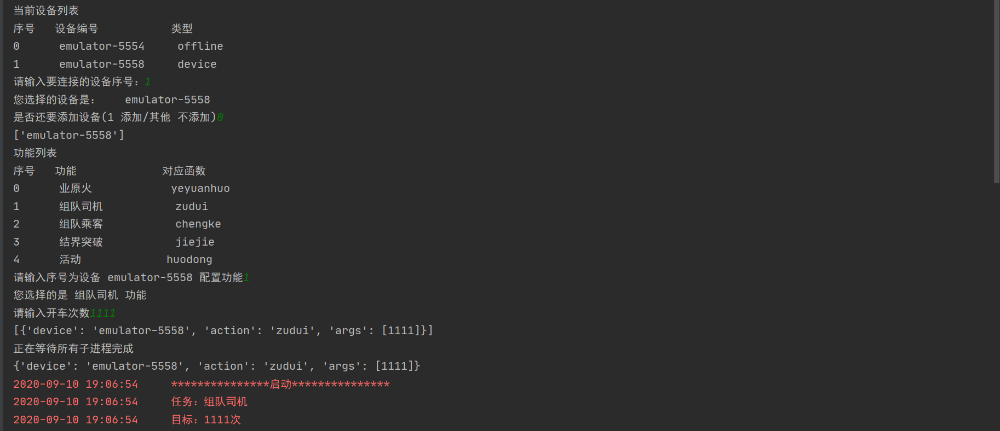
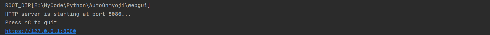
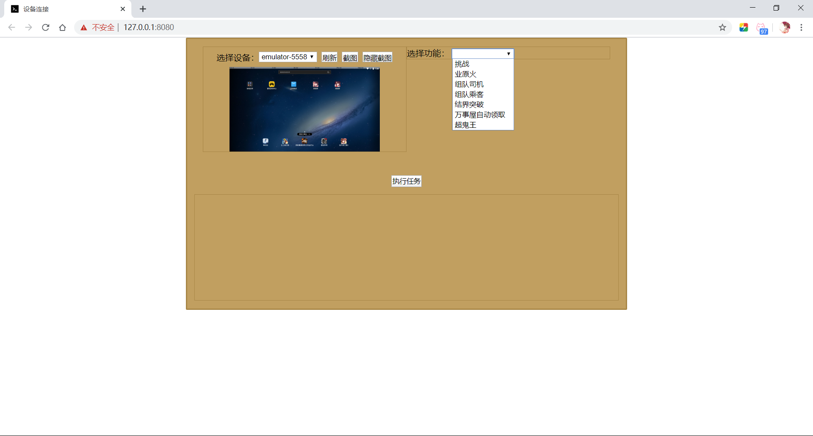

# AutoOnmyoji

本工具用于阴阳师自动化，可用于各位阴阳师大佬养老护肝使用。

## 注意事项

```diff
+ 代码略乱,如有Bug欢迎提交反馈!欢迎大家参与,有能力的同志欢迎一起更新!!!
- 该工具可能会有封号的风险!!!请酌情食用!!!
```

- 本软件完全免费,禁止恶意传播
- 本软件无毒无害,可放心食用
- 本软件功能并不完善,请谨慎使用
- 若发现有任何问题请停止使用,并提交反馈

## 使用指南

当前工具有 `命令行版本` 和 `WebGUI版本` 分别对应 `run.py` 和 `server.py`

###### 命令行版本:



###### WEB版本:





各位阴阳师可以下载本项目(需要Python环境,我使用的是3.7版本)并运行以下命令,

~~~shell
pip install -r requirements.txt
python run.py
~~~

或可以下载编译后的最终版本

具体的使用方法请参照后续的使用方法文档

## 运行环境

- python3.7
  - stopit
  - numpy
  - opencv-python
- 雷电模拟器
- adb

## 运行原理

本工具使用 `opencv` 进行图像识别，识别图片在当前屏幕中是否存在及其所在位置，模拟拟人化操作(一定时间的随机延迟和随机位置)，通过 `adb`[^adb] 操作设备进行点击。

本工具只是出于节省用户重复操作的目的，并不会使账号资源增加、技术提高。

## 更新说明

具体更新日志请看[这里](CHANGELOG.MD)

## 开源协议 (License)

该源代码使用了 [GPLv2](https://www.gnu.org/licenses/gpl-2.0.html) 开源协议。

This project is licensed under the [GPLv2](https://www.gnu.org/licenses/gpl-2.0.html) license.


[^adb]:安卓调试桥，全称：Android Debug Bridge