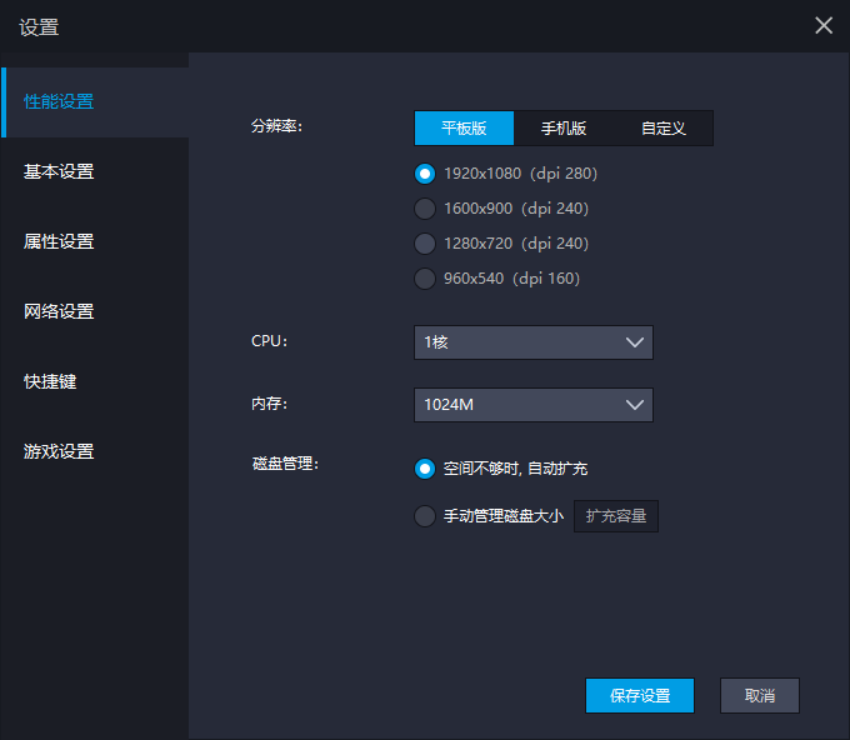
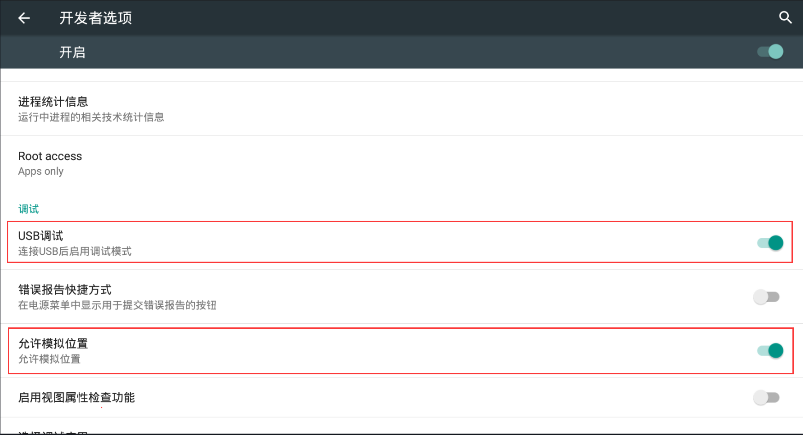
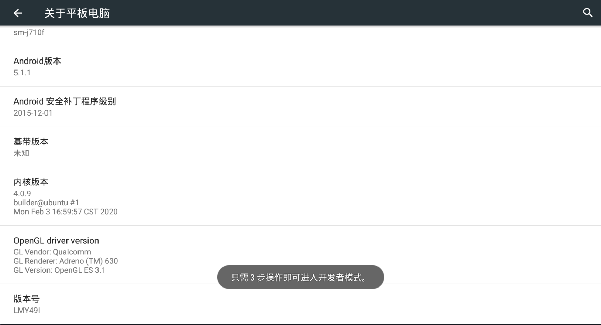
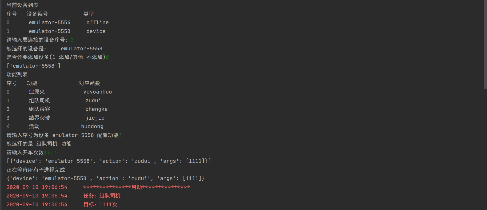
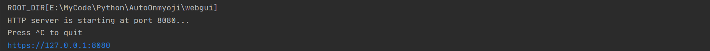
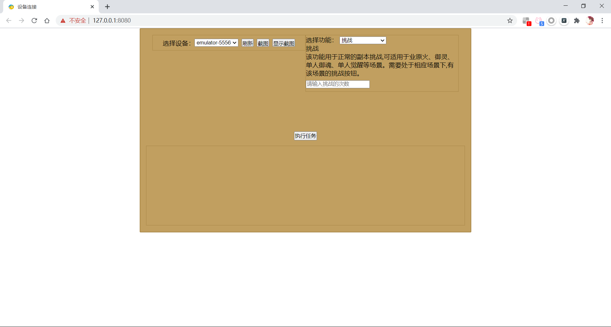
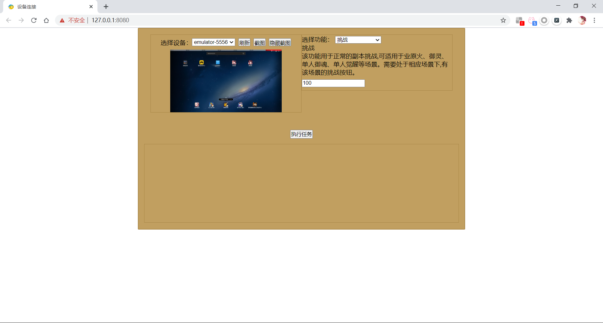
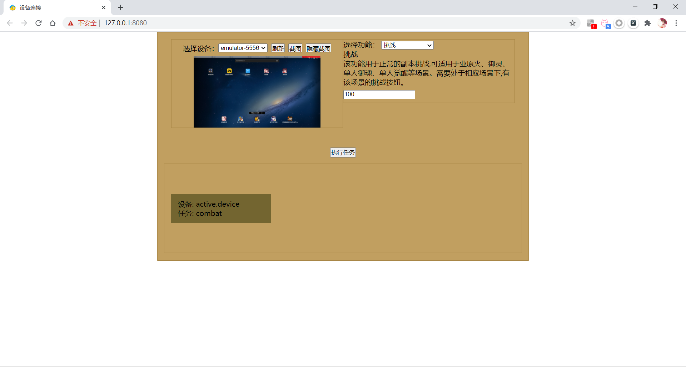
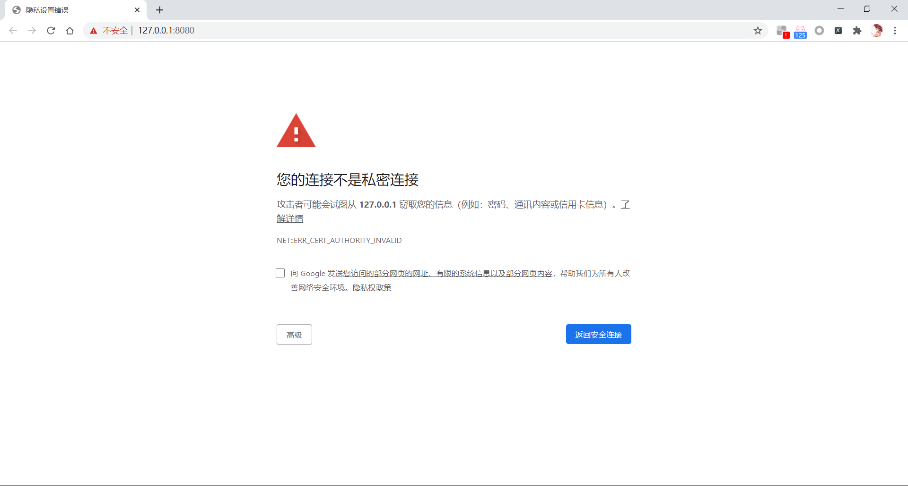

# AutoOnmyoji使用指南

#### ADB环境配置

本工具运行需要`adb`支持,请将`adb.exe`、`AdbWinApi.dll`、`AdbWinUsbApi.dll`三个文件和主程序放在同一录,**编译版本不需要此操作**

#### 模拟器配置

脚本测试暂时用的雷电模拟器，其它模拟器未做测试。

首先需要对模拟器分辨率进行如下设置：

然后，还需要对在设置里面进行更改

打开 `设置` => `开发者选项`，开启 `USB调试` 和 `允许位置模拟`;

若没有开发者选项，可以打开 `关于手机` / `关于平板电脑`，连续点击 `版本号` 即可进入开发者模式。

#### 运行

当前工具当前有 `命令行版本` 和 `WebGUI版本` 分别对应 `run.py` 和 `server.py`

##### 命令行版本

命令行版本需要执行`run.py`或`run.exe`

运行后根据提示输入选择即可运行

##### WEB版本

WEB版本需要运行`server.py`或`server.exe`

运行后根据提示使用游览器打开 `https://127.0.0.1:8080`(一般会自动打开)

可以在左侧选择设备，若无法分清设备，可以通过截图进行区分。

右侧可以选择执行的功能，选择后会根据功能显示功能介绍和参数输入框，输入参数后即可运行。

下面会显示正在执行的任务，当前仅供查看使用。

#### 网页无法打开

第一次访问可能会出现如下情况,点击`高级`按钮,选择下拉列表框中的`继续前往127.0.0.1（不安全）`选项

若未出现该页面,且一直打不开,请清除游览器缓存试试

